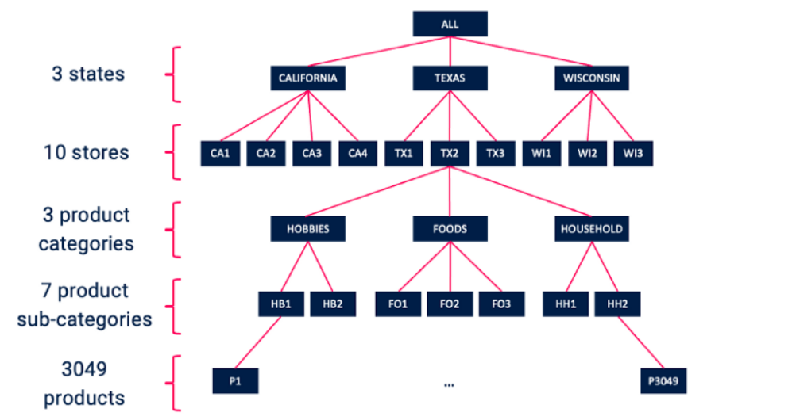
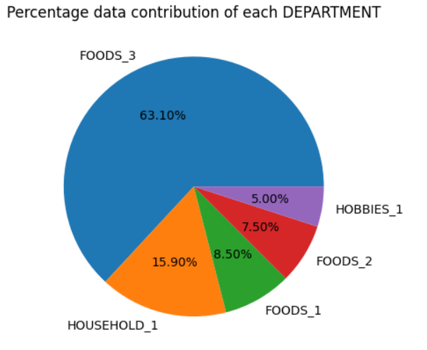
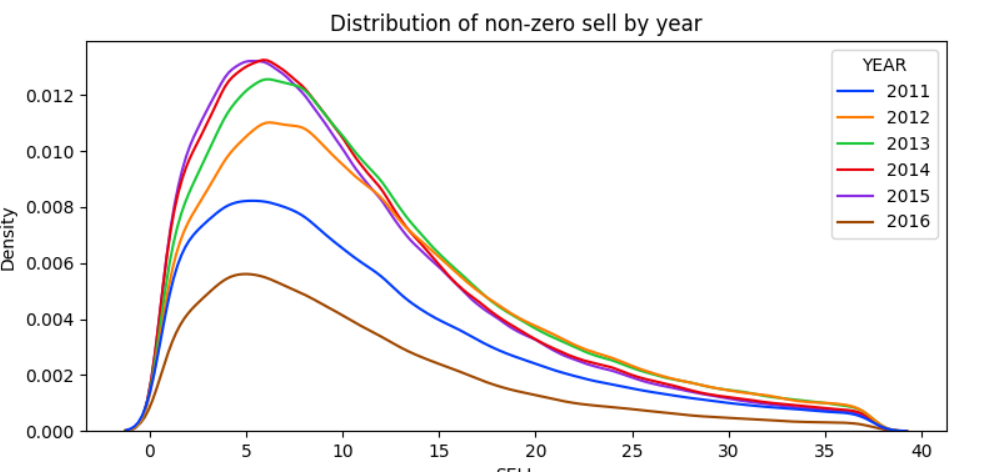
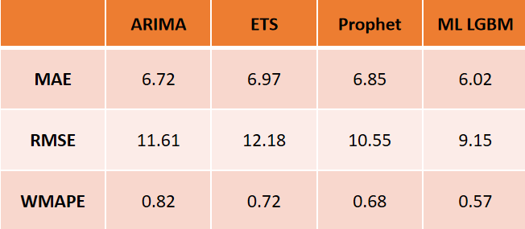

# M5 Forecast
"Analysis and sales forecasting of Walmart" is a research topic focused on processing, analyzing Walmart's sales data, and forecasting the factors affecting sales.
## Prepare Data
1. Load data
```python
df_calendar = spark.read.format("csv").options(header = True, delimeter = ";").load("/content/calendar.csv")
df_price = spark.read.format("csv").options(header = True, delimeter = ";").load("/content/sell_prices.csv")
df_product = spark.read.format("csv").options(header = True, delimeter = ";").load("/content/sales_train_evaluation.csv")
```
2. Data analyst






## Feature Engineering
* Datetime Indicator
* Holiday Calendar
* Lag, Rolling statistics
* Trendline Linear
* ...

## Build model
1. Statistical Sales Forecasting Model
   * ARIMA & Seasonal ARIMA
   * xponential smoothing
   * ...
2. Machine Learning 
   *  LGBM
   * Random forest
   * ...
3. Deep Learning
   * CNN
   * LSTM
   * Seq2seq
   * Transformer

## Result
